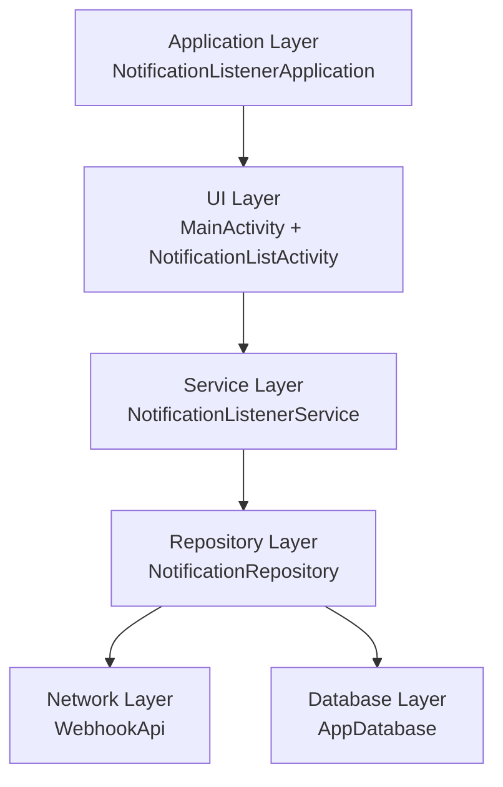
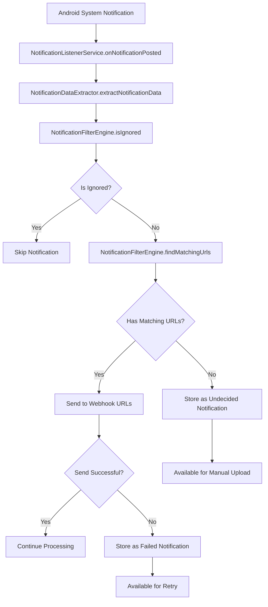

# n8n Notification Listener

This notification listener app acts as a bridge between your Android device's notifications and n8n automation workflows. It captures notifications from specified apps, applies configurable filtering rules, and sends the notification data to designated webhook endpoints. When network issues occur, notifications are stored locally and can be retried manually.

## Features

- Captures notifications as they appear
- Rule-based filtering by package name, title regex, and text regex
- Sends structured JSON data to webhook endpoints
- Manual retry for failed or undecided notifications

## Technical Architecture

### Core Components



### Data Flow



## JSON Payload Format

Notifications are sent to webhooks as JSON with the following structure:

```json
{
  "packageName": "com.example.app",
  "title": "Notification Title",
  "text": "Notification content text",
  "timestamp": 1234567890123,
  "id": 12345,
  "tag": "notification_tag"
}
```

## Installation & Setup

1. Build the APK:

```bash
./gradlew assembleDebug
```

2. Install on device (Android 15+):

```bash
adb install app/build/outputs/apk/debug/app-debug.apk
```

3. Grant Notification Access:

- Open the app
- Tap "Enable Notification Access"
- Grant permission in Android settings
- Return to app to verify permission status

## Development

### Project Structure

```
app/src/main/java/com/daohoangson/n8n/notificationlistener/
├── MainActivity.kt                 # Main UI
├── NotificationListenerService.kt  # Core service
├── config/
│   ├── WebhookConfig.kt            # Webhook configuration
│   └── NotificationFilterEngine.kt # Filtering logic
├── data/                           # Room database
├── network/                        # Retrofit API
├── ui/                             # Compose UI components
└── utils/                          # Utilities
```

### Testing

The project includes comprehensive unit tests:

```bash
./gradlew test
```
