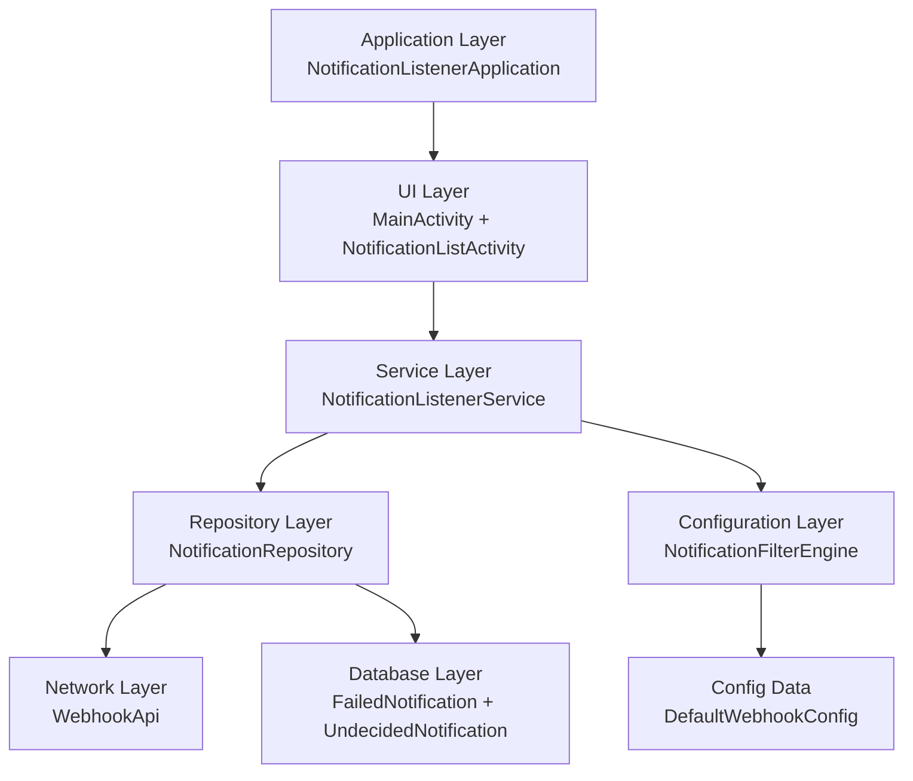
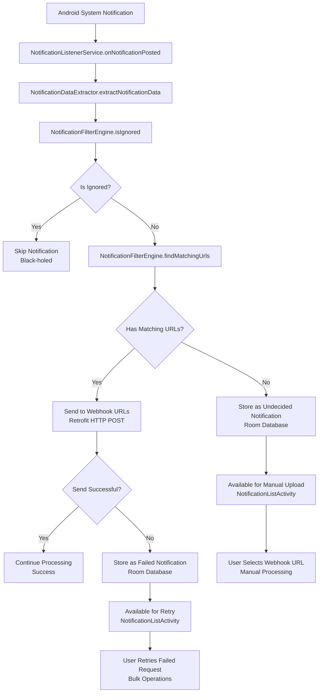

# n8n Notification Listener

This notification listener app acts as a bridge between your Android device's notifications and n8n automation workflows. It captures notifications from specified apps, applies configurable filtering rules, and sends the notification data to designated webhook endpoints. When network issues occur, notifications are stored locally and can be retried manually.

## Features

- **Real-time notification capture** - Listens to Android system notifications as they appear
- **Smart filtering system** - Rule-based filtering by package name with regex support
- **Webhook integration** - Sends structured JSON data to configurable webhook endpoints
- **Offline resilience** - Stores failed notifications locally for manual retry
- **Undecided notification handling** - Captures notifications that don't match any rules for manual processing

## Technical Architecture

### Core Components



### Data Flow



## JSON Payload Format

Notifications are sent to webhooks as JSON with the following structure:

```json
{
  "packageName": "com.example.app",
  "title": "Notification Title",
  "text": "Notification content text",
  "timestamp": 1234567890123,
  "id": 12345,
  "tag": "notification_tag"
}
```

## Installation & Setup

### Prerequisites

- **Android 15+ (API level 35+)** - The app requires the latest Android version
- **Android Studio** - For development and building
- **ADB** - For installing the APK

### Build & Install

1. **Configure webhook URL** (optional):

```bash
export WEBHOOK_URL_BANK="https://your-n8n-instance.com/webhook/your-webhook-id"
```

2. **Build the APK**:

```bash
# Debug build
./gradlew assembleDebug

# Release build (requires keystore configuration)
./gradlew assembleRelease
```

3. **Install on device**:

```bash
# Debug APK
adb install app/build/outputs/apk/debug/app-debug.apk

# Release APK
adb install app/build/outputs/apk/release/app-release.apk
```

3. Grant Notification Access:

- Open the app
- Tap "Enable Notification Access"
- Grant permission in Android settings
- Return to app to verify permission status

## Development

### Technology Stack

- **Language**: Kotlin
- **UI Framework**: Jetpack Compose
- **Architecture**: MVVM with Repository Pattern
- **Dependency Injection**: Hilt
- **Database**: Room (SQLite)
- **Networking**: Retrofit + OkHttp
- **JSON Serialization**: Gson
- **Testing**: JUnit 4, MockK, Coroutines Test
- **Build System**: Gradle with Kotlin DSL

### Project Structure

```
app/src/main/java/com/daohoangson/n8n/notificationlistener/
├── MainActivity.kt                 # Main UI
├── NotificationListenerService.kt  # Core service
├── config/
│   ├── WebhookConfig.kt            # Webhook configuration
│   └── NotificationFilterEngine.kt # Filtering logic
├── data/                           # Room database
├── network/                        # Retrofit API
├── ui/                             # Compose UI components
└── utils/                          # Utilities
```

### Testing

The project includes comprehensive unit tests:

```bash
# Run all unit tests
./gradlew test
```
